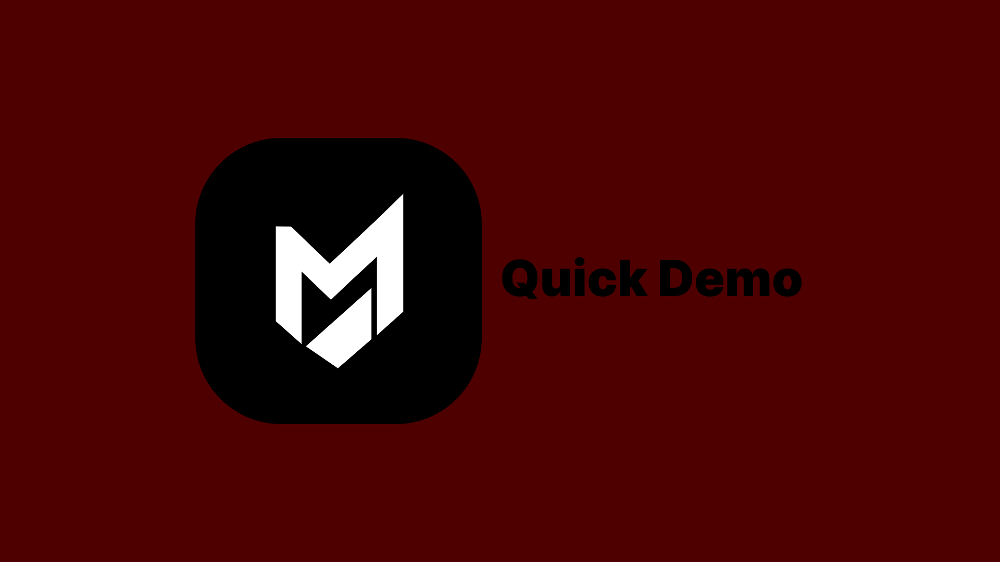

# MeoMaya

A pure-Python, high-speed NLP framework with a clean, modular core for text processing. Optional multimodal pipelines, local-only transformers, a REST API, and hardware-aware execution (CPU/CUDA/MPS).

[](https://github.com/KashyapSinh-Gohil/MeoMaya/blob/MeoX/Docs/Quick%20demo.mp4)


## Quick start

```bash
python -m venv .venv
source .venv/bin/activate
pip install -r meomaya/requirements.txt
```

Run API:

```bash
uvicorn meomaya.api.server:app --host 0.0.0.0 --port 8000
```

Run CLI:

```bash
python -m meomaya "Hello from MeoMaya!" --mode text
```

Offline mode:

```bash
export MEOMAYA_STRICT_OFFLINE=1
```

## License

Polyform Noncommercial 1.0.0. For commercial licensing, contact Kagohil000@gmail.com.


